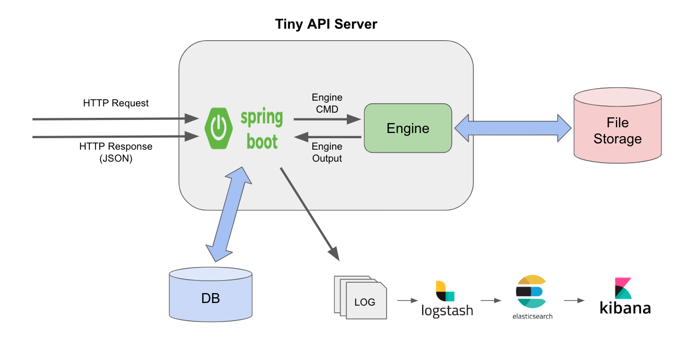
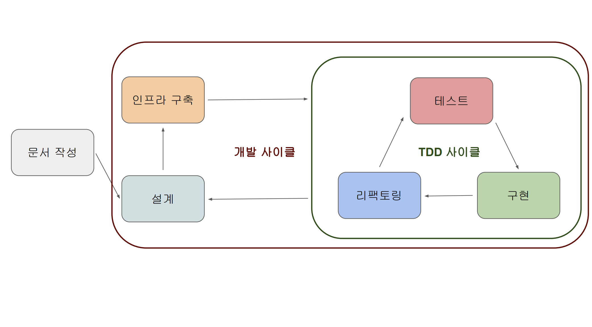
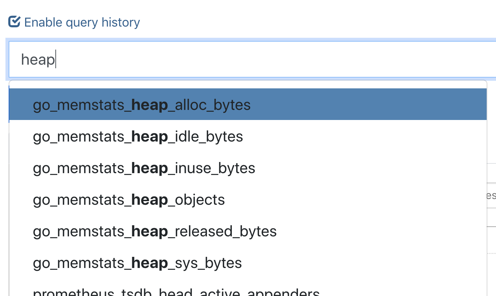
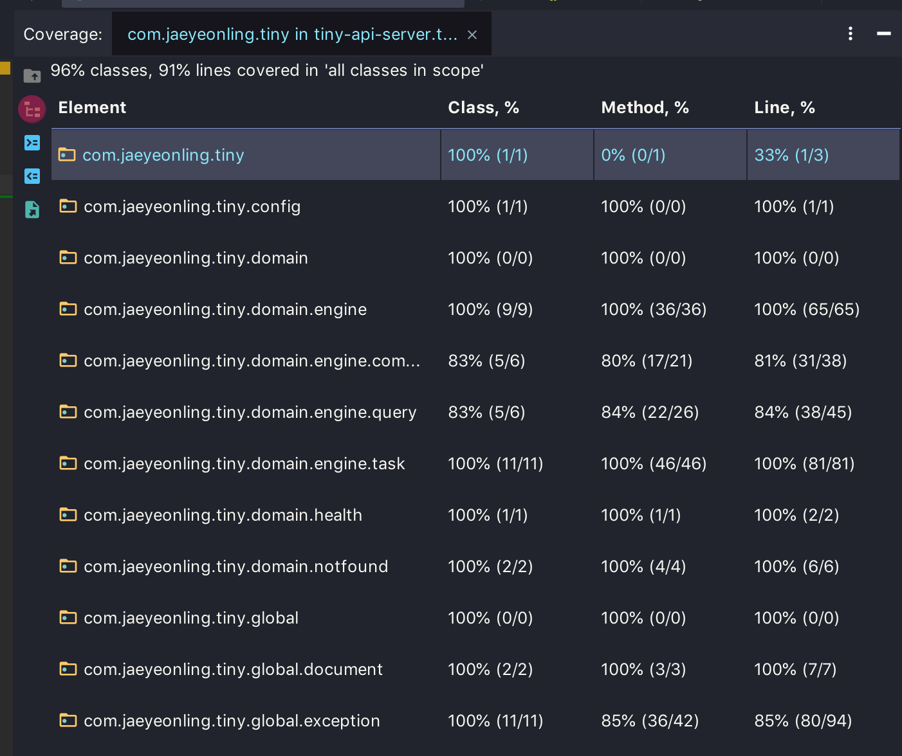
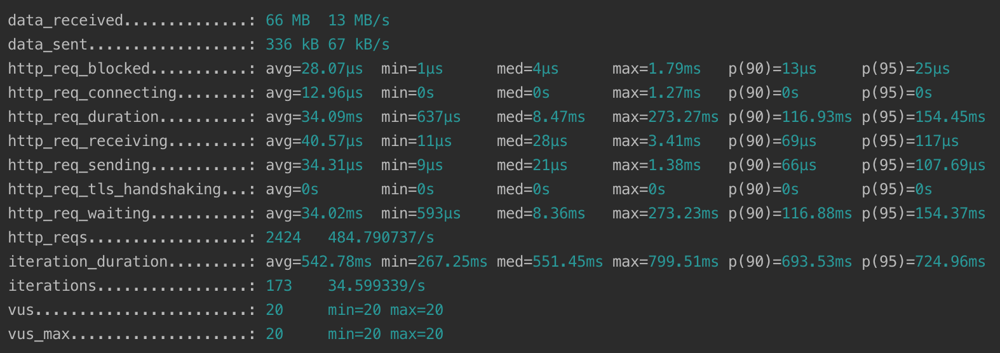

# Tiny API Server  
[](https://travis-ci.org/jaeyeonling/tiny-api-server)

> [과제 내용](./docs/requirements.md)
>
> 과제 후 코드가 아까워서 소소한 수정 후 업로드 
> 1. 기존 요구사항에서 MongoDB -> RDB 변경
> 2. 주요 비즈니스 로직 제거


## 환경
* 언어: Java 
    * JDK 12 
* 빌드툴: Gradle
    * Version: 5.4
* 웹 프레임워크: SpringBoot
    * RESTful
* 데이터베이스: H2 DB
* 라이브러리 버전
    * [참고](./build.gradle)
* 테스트: JUnit5
* 문서화: REST Docs
    * Asciidoc
    * [문서](./src/docs/asciidoc/index.adoc)
        * 정보가 보이지 않으면, 테스트 코드를 돌리시거나 빌드하시면 됩니다.
        * 빌드 시 HTML 파일로 떨구도록 설정해뒀습니다.
            * [참고](./docs/index.html)
* 로그 모니터링
    * ELK Stack (Elastic Search, Logstash, Kibana)
* 부하 관련
    * Load: k6
        * [참고](./script/k6/stress.js)
    * Memory Leak: Prometheus

## 설계

* 기존에 보내주신 아키텍처를 따랐습니다.

## 개발 방법 

* TDD 사이클을 지키며 개발했습니다.

## 폴더 구조
* DDD 기반의 폴더 구조를 가졌습니다.
    * 일반적인 계층(Layered Architecture) 구조와는 조금 다른데, 스프링에서 사용하기 편하게 조금 변형하여 사용합니다.

```
.
+-- config              // 설정 파일
+-- domain              // 도메인 로직
    +-- engine          // 핵심 로직
    +-- health          // 서버 상태 체크
    +-- notfound        // 구현되지 않은 이외 요청 시 처리
+-- global              // 도메인에서 공용으로 쓰이는 것들
    +-- entity          // DB Entity 정보
    +-- exception       // 예외처리 정보
+-- Application
```

---

## 전체적인 로직 설명
* 엔진을 생성할 수 있다.
* 엔진을 실행할 수 있다.
    * 엔진을 실행하면 작업이 생성된다.
    * 엔진 실행 시 로깅한다.
* 작업의 상태를 조회할 수 있다.
* 작업이 완료됐다면 리포트를 뽑을 수 있다.
    * 리포트를 조회 시 로깅한다.
* 로깅된 정보들을 조회할 수 있다.

## 요구조건 설치
1. JDK 12 설치
* https://stackoverflow.com/questions/52524112/how-do-i-install-java-on-mac-osx-allowing-version-switching

2. Docker 설치
* https://docs.docker.com/docker-for-mac/install/

3. Docker Compose 설치
* https://github.com/Yelp/docker-compose/blob/master/docs/install.md

4. k6 설치
* https://docs.k6.io/docs/installation

## 환경 셋팅
### 애플리케이션 서버

서버 빌드
```shell
./gradlew build
```

서버 시작
```shell
./gradlew bootRun
```

### Logstash 
* pipeline 로그 경로가 절대경로이기 때문에 변경하여야 합니다.
* [설정 파일](./docker/logstash/pipeline/logstash.conf)
```shell
path => "/Users/jaeyeonling/workspace/jaeyeonling/tiny-api-server/*.log"
```
부분을 현재 경로로 바꿔주시면 됩니다.

### Docker Compose
* ELK와 Prometheus를 실행해줘야 합니다.

```shell
docker-compose -f docker-compose.yml up
```

### 로그 모니터링
* Kibana에서 확인 가능합니다.
* http://localhost:5601

### 부하 테스트
* k6 script를 실행해야 합니다.

```shell
# 10개의 가상 유저로 5초간 요청
k6 run --vus 10 --duration 5s ./script/k6/stress.js
```

### 메모리 릭
* Prometheus에서 확인 가능합니다. 
* http://localhost:9090/graph?g0.range_input=1h&g0.expr=go_goroutines&g0.tab=0
* graph로 보시면 시각화된 정보를 확인할 수 있습니다.
* 메모리 부분은 정보를 확인하시면 됩니다.


---

#### 언어
* Java로 개발한 이유
    * 가장 자신있고,
    * 요즘 OOP에 대한 관심이 많습니다.

#### 데이터베이스
* Docker로 MongoDB도 분리하려고 했으나, 굳이 필요성을 못느껴 Embedded로 대체합니다.

#### 테스트
* 이번 프로젝트에서 Mock 프레임워크는 사용하지 않았습니다.

#### 문서화
* Swagger를 사용하지 않고 REST Docs을 사용한 이유는
    * 테스트 코드 기반으로 만들어주기 떄문에 테스트 코드가 강제되는 장점(단점...?)
    * 테스트 코드가 부실하거나 테스트가 힘든 코드가 있다면 문서화도 힘들어지기 때문에 코드 품질이 좋아집니다.

#### 로그 모니터링
* 별도 Elastic Search 에 트랜잭션 로그를 쌓는 것이 아닌 (트랜잭션 로그는 MongoDB에 쌓고 있습니다.) 서버 로그만 연동해뒀습니다.
* 데이터가 중심이 되는 서비스인 것 같아서 구축했습니다. 
    * 구축은 해뒀는데 지금 상황에서 활용할게 없네요.

#### 보안 관련
* Security 에 대한 부분은 구헌하지 않아 보안 관련 내용을 적을 수 없네요.
* 현재 상태에서는 인증과 인가에 대한 부분이 없기 때문에 애매한 것 같습니다. 
    
#### 정적 코드 분석
##### code coverage
* IDE(IntelliJ) 커버리지로 대체


##### style lint
* IDE(IntelliJ) 플러그인으로 대체
* 요즘 IDE가 좋아서 별도로 처리할 쓸 필요성을 못느끼고 있습니다.

#### 부하 관련
##### Load
* 자바 부하 테스트의 경우 JMeter 같은 툴을 많이 쓰나, 개인적으로 스크립트 기반의 테스트 툴을 선호합니다.
* 장단점이 있으나, 자동화가 가능하며 가볍고 커스터마이징이 손쉬워서 애용합니다.


##### Memory Leak
* Grafana와 연동하여 보기가 더 편하지만, 별도의 셋팅을 하셔야하는 번거로움이 있어 뺐습니다.

##### ETC
* 특별한 이유(기존 호환성 문제가 있는 경우, ...)가 있는 것이 아니면 전부 최신 버전을 사용하려고 합니다.
* 엔진에서 처리가 중요한데 요구사항이 명시적이지 않아, 로깅만 하도록 처리해뒀습니다.
